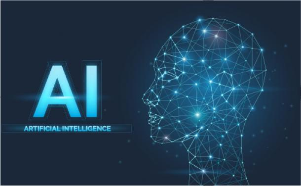

# Project Ideas with README Templates

## 1. Convex Hull

### Project Description
The convex hull of a set of points is the smallest convex shape enclosing all the given points without any inward angles greater than 180 degrees. It represents the outer boundary that forms a convex polygon or polyhedron, essential in computational geometry for various algorithms involving point sets, such as collision detection, spatial analysis, and computational geometry problems. To accomplish this, Graham's scan algorithm is impleted to find the convex hull.

### Graham's Scan Algorithm

1. Given a set of points, sort through and find the lowest Y coordinate value. If there are multiple, use the lowest X value among them. This one point will be the anchor point.

2. Sort the remaing points by the angle they form with the anchor point going from smallest to largest starting with the anchor point. If two angles are the same, put the smallest distance from the anchor point first.

3. If there are less than 3 data points, the convel hull is unable to be found.

4. Create a vector to store the points that will form the convex hull. Push the anchor point and the next data point from the sorted list to the convex hull vector.

5. Start with the third data point and anaylze the orientation of this point with the previous 2. If the orientation of these 3 points are counter-clockwise, add it to the convex hull vector. If not, move on to the next point and continue to analyaze that point with the previous 2.

6. Print out the components of the convex hull.

### Expected Outcomes

At the conclusion of this project, we will have working code that can find the convex hull of a set of points and store them into a vector. Using this vector, we can implement different functions that provide real world scenarios to display the uses of a convex hull. Main implemenetations are collision detection, image processing and shape detection.

### How to run the code

Our code takes a text file with a list of points as an input. Each point should be on its own line, sepereating the x and y coordinate by a space. This text file is the data that will be used to calcualte the convex hull.

## 2. AI-Enhanced Personalized Learning Platform

### Project Description

This project focuses on the development of a personalized learning platform empowered by artificial intelligence (AI). The platform will analyze user learning patterns and adapt educational content to individual needs, enhancing the learning experience.

### Project Steps

1. **AI Model Selection**: Choose a machine learning or deep learning model to analyze user learning data and provide personalized content recommendations.

2. **Educational Context**: Define the educational context of the platform, specifying the target audience (e.g., students, professionals) and the subject matter.

3. **User Profiling**: Develop a system to collect and analyze user data, understanding their learning preferences, strengths, and weaknesses.

4. **Content Adaptation**: Implement algorithms that adapt educational content based on user profiles, creating personalized learning experiences.

5. **User Interface Design**: Create an intuitive and user-friendly interface to engage users and present personalized content effectively.

6. **Testing and Evaluation**: Evaluate the AI model's performance and user satisfaction through testing, feedback collection, and iterative improvements.

7. **Scalability**: Ensure the platform can scale as the user base grows, accommodating diverse learning needs and preferences.

8. **Documentation and User Guide**: Prepare documentation and a user guide to help users understand and maximize the benefits of the personalized learning platform.

### Expected Outcomes

By the end of this project, you will have developed a personalized learning platform driven by AI, offering users tailored educational content. This experience will deepen your understanding of AI in education and technology's potential to enhance learning.

### Collaboration and Expertise

Collaborating with educators, instructional designers, and experts in AI can provide valuable insights and ensure that the platform aligns with educational best practices.

## 3. Blockchain-Based Supply Chain Management

### Project Description

This project centers on the development of a blockchain-based system to enhance supply chain management. Blockchain technology will be used to track and verify product movements, ensuring transparency and reducing fraud.

### Project Steps

1. **Blockchain Technology Selection**: Choose an appropriate blockchain technology (e.g., Ethereum, Hyperledger) for the supply chain management system.

2. **Supply Chain Context**: Define the specific supply chain context (e.g., food, pharmaceuticals) and set the scope of the project.

3. **Data Structure Design**: Design the blockchain data structure to store information about product origins, movements, and verification points.

4. **Smart Contracts**: Create smart contracts that automate and enforce supply chain rules, such as product verification at each stage.

5. **User Interface Development**: Develop user interfaces for supply chain stakeholders to interact with the blockchain system, tracking product movements and history.

6. **Security and Auditing**: Implement security measures to protect the integrity of the blockchain and auditing capabilities for transparency.

7. **Testing and Verification**: Verify the system's effectiveness in tracking and securing the supply chain.

8. **Documentation and User Guide**: Provide documentation and user guides for supply chain participants to understand and use the blockchain-based system.

### Expected Outcomes

By the end of this project, you will have created a blockchain-based supply chain management system, increasing transparency and trust in product movements. This project will deepen your understanding of blockchain technology and its applications in logistics and transparency.

### Collaboration and Expertise

Collaborating with logistics experts, supply chain managers, and blockchain specialists is essential to ensure that the system aligns with industry standards and security requirements.
